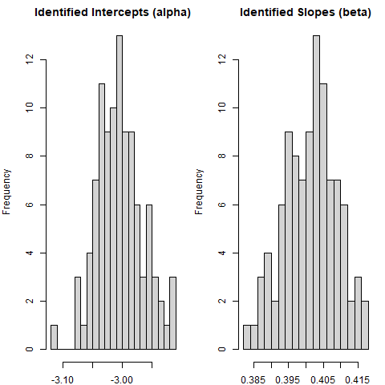
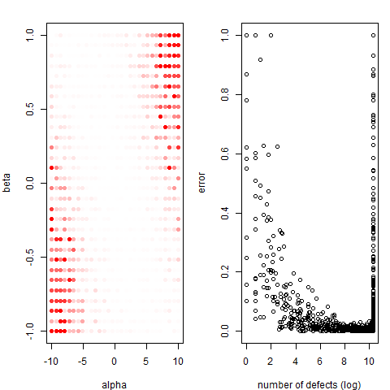

# Operationalizing Threats to MSR Studies by Simulation-Based Testing (MSR2022)

** New cases for EMSE versions of this paper are already included (see the table). **

This repository provides the **supplementary material** for the
MSR paper on simulation-based testing. We structure this
README consistent with the sequential order of the
paper's first part, introducing simulation-based testing. 
The source code is also provided in **separate
R files** to ease running.
We consider this textual presentation as a more technical
version of the content.

A **preprint** of the paper can be found [here](paper.pdf).
The original material linked during the review process can
be found [here](original_material_review.zip).
The following is a more systematic presentation of the material.


The **cases** are not presented in this text to avoid an
overlap with the paper. We provide the cases in
terms of **extensively documented R code**.
The code includes the simulation, the original analysis method,
and eventually a second, revised methodology.
Find the links to the material below.

Case  | Threat                   | Paper Section | Source Code
------------- |--------------------------|---------------| -------------
1  | Dependent Observations   | MSR Section 5 | [simulation](dependent.R)
2  | Causation vs. Prediction | MSR Section 6 | [simulation](causation.R)
3  | Control of Variables     | MSR Section 7 | [simulation](control.R) and [revised](control_revised.R)
4  | Correlated Variables     | MSR Section 8 | [simulation](correlated.R)
~  | Distribution             | (EMSE Review) | [simulation](distribution.R)
~  | Randomized Experiment    | (EMSE Review) | [simulation](experiment.R)


## Original Methodology (Paper section 3.1, [source code](nutshell_a.R))
We now start with a more technical presentation to simulation-based
testing.

The following R code is highly simplified but **typical for an MSR/ESE data analysis
methodology**. The first part of the code loads the data.
```R
data <- read.csv("metrics_elasticsearch.csv")

X <- log(data$linesChanged + 1)
Y <- as.integer(data$buggy == "true")
```
We borrow the data set from [Falcão et al.](https://github.com/filipefalcaos/saner-2020) We only use the amount of changed lines by a commit, which is stated-log transformed, and whether the commit is buggy or not. We store both **observed variables as X and Y**.

The next part of the code fits the **logistic regression model**.
```R
model <- glm(Y ~ X, family = binomial())
```
We use R's build in generalized linear model (glm) to specify the relation of interest. We use the R formula (Y ~ X) and set the output distribution to be binomial.

Next, we **inspect the summary** of the fit in terms of the intercept and slope (later called alpha and beta). We ignore confidence estimates in this part of the presentation.
```R
print(coef(model))
```
The **coefficients** are the same as the rounded numbers shown in
the paper. Studies typically show them in tabular form
to answer research questions.
The intercept reflects the average defect rate and the
X column refers to the corresponding slope (i.e., the influence
of X on defects).

| (Intercept)   |  X            |
| ------------- |:-------------:|
| -3.2861068    | 0.4543962     |

We see a positive influence of lines of code and low average defects.

## Simulation as a Substitution for Reality (Paper section 3.3, [source code](nutshell_b.R))
We will now implement a basic simulation-based 
test, **substituting** some **observed and unobserved**
variables **with synthetic variables**.

We again load the data and do some preparations.
```R
data <- read.csv("metrics_elasticsearch.csv")
X <- log(data$linesChanged + 1)
N <- length(X)
```
We load the data, extract the stated-log transformed changed lines (X), and the number of observations (N) that we have in this data set. However, this time we do not need the final **defect (Y)** as we will **replace it by a synthetic variable**.

The following part is critical, as it does the substitution of
observed and unobserved variables with synthetic variables.
```R
alpha <- -3.0
beta <- 0.4
prob <- 1 / (1 + exp(- (alpha + beta * X)))
```
We first **set alpha and beta** to some values that we make up (we 
recommend the reader to try alternatives). Next we **produce
the corresponding probability** of defects as a function of alpha, beta and X. The code is vectorized. Since X is a vector, the result of the above arithmetic operations is a vector too. Further, we see the [inverted logistic function](https://en.wikipedia.org/wiki/Logit) (1 / (1 + exp(- x)), which is typically hidden in the internals of software packages for fitting logistic regression models.
We use this functional relation (in revers).

The next part simulates the final defects.

```R
set.seed(1)
Y <- rbinom(N, size = 1, prob = prob)
```
We first set the seed so that the generated random defects keep the same. Then we **draw N random defect** classifications
**from a binomial distribution**, with a single trial (size = 1). Since the
random number generator rbinom is also vectorized, we can pass it the vector of probabilities, and produce a defect
corresponding to the probabilities produced by the individual X entries.

We finally **run the original methodology** again, not on
the real data, but **using the synthetic data instead**.
```R
model <- glm(Y ~ X, family = binomial())
print(coef(model))
```
The results of this code are shown in the next table.
The **results are almost equivalent** to the alpha and beta set 
in the previous **simulation** code. We recommend that the
reader explores alternatives.

| (Intercept)   |  X            |
| ------------- |:-------------:|
|  -2.9709721   | 0.3936837     |

## Uncertainty (Paper section 3.4.2, [source code](nutshell_uncertainty.R))

We now explore how **uncertain the identified alpha and
beta are**, as the previous example show that synthetic
and identified variables are not exactly the same.

The following code runs the previous code with **different
seeds** and collects the identified coefficients in the results table
```R
results <- NULL
for (seed in 0:100) {
    set.seed(seed)

    alpha <- -3.0
    beta <- 0.4
    prob <- 1 / (1 + exp(-(alpha + beta * X)))
    Y <- rbinom(N, size = 1, prob = prob)
    model <- glm(Y ~ X, family = binomial())

    results <- rbind(results, coef(model))
}
```
We see a simple loop, iterating and setting different seeds while
running the code from the previous section.
Identified alpha
and beta are stored in a two column matrix (results) for each simulation run, using rbind.

We may now **plot the identified** alphas and betas from the matrix in terms of two **histograms**.
```R
par(mfrow = c(1, 2))
hist(results[, 1], 
     breaks = 20, 
     main = "Identified Intercepts (alpha)", 
     xlab = "")
hist(results[, 2], 
    breaks = 20, 
    main = "Identified Slopes (beta)", 
    xlab = "")
```
The plot shows the identified alphas and betas over the **100 simulation runs**.
We recommend the reader to change the number of iterations and also to limit the number of observations, by dropping some observations from X and comparing the uncertainty.



We see that the identified variables are **close** to the corresponding
values set in the simulation, but they are **not absolutely exact**.

## Parametrized Tests (Paper section 3.4.3, [source code](nutshell_parameters.R))

We can **explore the impact of different alpha and beta**,
by going through different combinations in the simulation, while
storing synthetic and the corresponding identified alpha and beta 
in a matrix.
```R
results <- NULL
for (alpha in seq(-10, 10, length.out = 30)) {
  for (beta in seq(-1, 1, length.out = 30)) {

    prob <- 1 / (1 + exp(- (alpha + beta * X)))
    Y <- rbinom(N, size = 1, prob = prob)
    model <- glm(Y ~ X, family = binomial())

    ndefects <- sum(Y)
    results <- rbind(results, c(coef(model), alpha, beta, ndefects))
  }
}
```
The first part of the code is a **nested loop to explore
combinations**. The combination of alpha and beta is used to
produce the synthetic Y variable. Hereafter, the original methodology
is, used to identify alpha and beta again using the
X and Y. All relevant variables, including the total number
of defects in Y, are stored in the matrix called results
for later analysis.

We can now take this data, and extract
the important insights, mentioned in the paper.
```R
error <- pmin(abs(results[, 2] - results[, 4]), 1)
```
The code first computed the error, i.e., the **absolute difference between
the synthetic beta and the identified beta** (with an upper
limit of 1 to enable easy conversion to a color). 

Finally, we produce different plots to visualize the results.
```R
par(mfrow = c(1, 2))
plot(results[, 3], results[, 4],
    col = rgb(1, 0, 0, error),
    pch = 16,
    xlab = "alpha",
    ylab = "beta",
    main = "")

plot(log(results[, 5]), error, 
    xlab = "number of defects (log)")
```
Comparable to the paper, we plot the error for different
synthetic alpha and beta values. We also plot the relation
between errors and total number of defects that we also have 
recorded.



The left plot show that with both low or high alpha and beta,
the error increases. The right plot indicates why (imbalance between
defect and non-defect commits).
